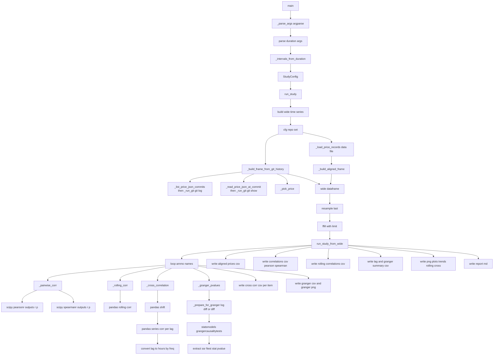
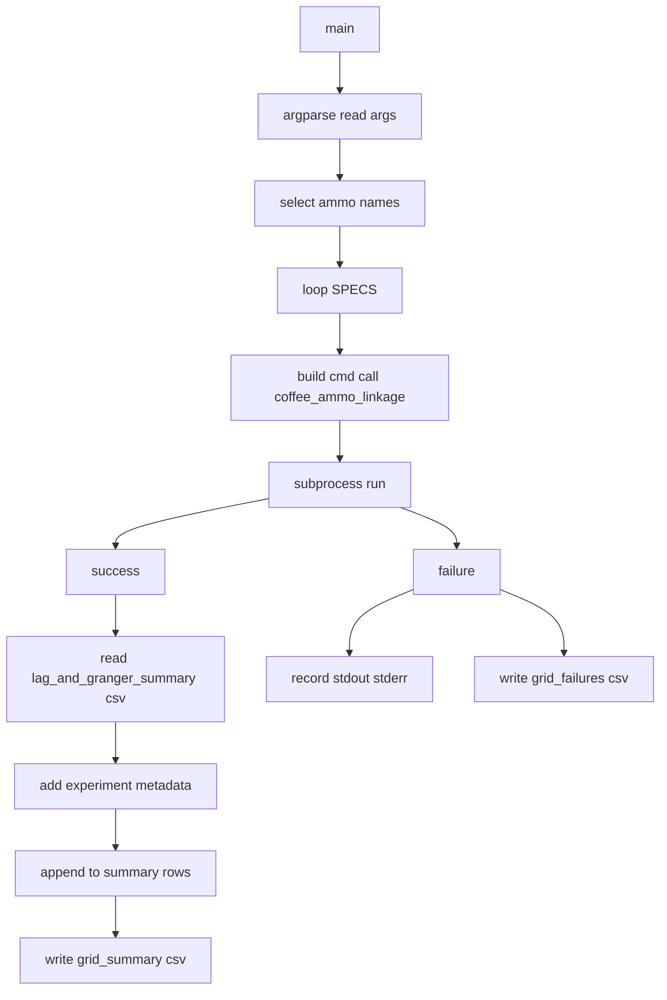
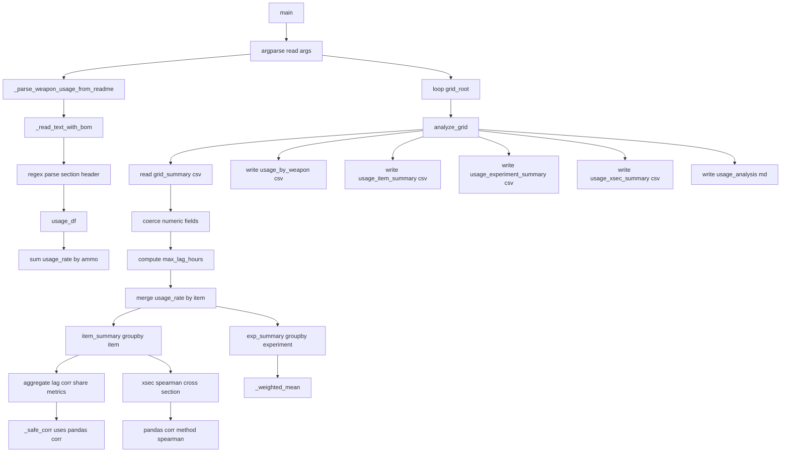

# 盒装挂耳咖啡与高级弹药联动实验

参考 `盒装挂耳咖啡与高级弹药价格联动分析方案.docx` 的流程（对齐、缺失处理、整体/滚动相关、交叉相关、格兰杰因果检验），在本仓库的 `price.json` 数据上复现实验并输出结果文件。

## 运行

在 `/home/delta/DeltaForcePrice` 目录执行（数据仓库在子目录 `DeltaForcePrice/`）：

```bash
python -m study.coffee_ammo_linkage \
  --repo DeltaForcePrice \
  --since 2025-08-20 --until 2025-12-15 \
  --out-dir study_outputs/coffee_ammo_linkage
```

如需把交叉相关的滞后搜索扩展到“天级别”，可用 `--max-lag`（按 `--freq` 自动换算）：

```bash
python -m study.coffee_ammo_linkage \
  --repo DeltaForcePrice \
  --since 2025-08-20 --until 2025-12-15 \
  --max-lag 4D \
  --out-dir study_outputs/coffee_ammo_linkage_lag_4d
```

如需把交叉相关/滚动相关/格兰杰都提升到“7 天级别”，建议将对齐频率降到小时级（避免 `10min` 下 lag=1008 过慢）：

```bash
python -m study.coffee_ammo_linkage \
  --repo DeltaForcePrice \
  --since 2025-08-20 --until 2025-12-15 \
  --freq 1H --ffill-limit 1 \
  --max-lag 7D \
  --rolling-window-duration 7D --rolling-min-periods-duration 5D \
  --max-granger-lag-duration 7D \
  --out-dir study_outputs/coffee_ammo_linkage_all_7d
```

输出目录会生成 `report.md`、若干 `.csv` 以及 `.png` 图表文件。

## 示例：`g1_24h/` 目录里的文件从哪来

以 `DeltaForcePrice/study_outputs/coffee_ammo_grid_0922_1109/g1_24h/` 为例：

- 该目录由 `DeltaForcePrice/study/run_coffee_ammo_grid.py` 的 `SPECS` 中的 `g1_24h` 这一组参数生成：它会 `subprocess.run()` 调用 `python -m study.coffee_ammo_linkage ... --out-dir <out_root>/g1_24h`。
- 目录内的所有 `.csv/.png/report.md` 均由 `DeltaForcePrice/study/coffee_ammo_linkage.py` 的 `run_study()` → `run_study_from_wide()` 产出（`wide` 由 Git 历史构建并按 `--freq` 对齐后进入分析环节）。

`g1_24h/` 内典型文件与产出链路如下（“指标调用链”写到最底层函数）：

- `aligned_prices.csv`：`run_study_from_wide()` 直接将对齐后的 `wide` 写出。
- `correlations.csv`（整体相关：Pearson/Spearman）：
  - `run_study_from_wide()` → `_pairwise_corr(coffee, ammo)`
  - `_pairwise_corr()` → `scipy.stats.pearsonr(x, y)`（Pearson 相关系数与 p 值）
  - `_pairwise_corr()` → `scipy.stats.spearmanr(x, y)`（Spearman 相关系数与 p 值）
- `rolling_correlations.csv`（滚动相关）：
  - `run_study_from_wide()` → `_rolling_corr(coffee, ammo, window, min_periods)`
  - `_rolling_corr()` → `pandas.Series.rolling(...).corr(...)`
- `cross_corr__7.62x51mm M62.csv`（以及同类 `cross_corr__*.csv`，交叉相关明细）：
  - `run_study_from_wide()` → `_cross_correlation(coffee, ammo, max_lag_intervals, interval)`
  - `_cross_correlation()` → `ammo.shift(...)`（逐 lag 平移）→ `Series.corr(...)`（逐 lag 相关系数）
  - `_cross_correlation()` → 基于 `freq` 折算 `lag_hours`
- `cross_corr.png`（交叉相关叠图）：
  - `run_study_from_wide()` → `_plot_cross_corr(cross_corr_dict)`（数据来自各 `cross_corr__*.csv` 同源的 DataFrame）
- `granger__coffee_to__7.62x51mm M62.csv`（以及同类 `granger__coffee_to__*.csv`，咖啡→弹药格兰杰）：
  - `run_study_from_wide()` → `_granger_pvalues(target=ammo, cause=coffee, maxlag)`
  - `_granger_pvalues()` → `_prepare_for_granger()`（`log(price).diff()` 或 `diff()`）
  - `_granger_pvalues()` → `statsmodels.tsa.stattools.grangercausalitytests(...)` → 提取 `ssr_ftest` 的统计量与 p 值
- `granger__7.62x51mm M62_to__coffee.csv`（反向对照：弹药→咖啡格兰杰）：
  - 调用链同上，只是 `target/cause` 对调
- `granger__coffee_to__7.62x51mm M62.png`（格兰杰 p 值曲线图）：
  - `run_study_from_wide()` → `_plot_granger(granger_df)`
- `lag_and_granger_summary.csv`（每个弹药的“交叉相关峰值 + 格兰杰最小 p 值”摘要）：
  - `run_study_from_wide()` 在每个弹药循环里汇总：交叉相关峰值（含正/负滞后拆分峰值）+ 格兰杰最小 p 值与对应 lag
- `indexed_trends.png`（标准化趋势图，首个点=100）：
  - `run_study_from_wide()` → `_plot_indexed_trends(wide_subset)`
- `rolling_corr.png`（滚动相关可视化）：
  - `run_study_from_wide()` → `_plot_rolling_corr(rolling_corr_df)`
- `report.md`（本次运行的参数摘要与输出索引）：
  - `run_study_from_wide()` 直接生成。

## Mermaid 框架图

下面分别为 `study/` 下三个脚本的框架图（强调主要函数调用过程），并在图中标注关键指标（Pearson/Spearman/滚动相关/交叉相关/格兰杰）的调用链。

### 1) `coffee_ammo_linkage.py`



### 2) `run_coffee_ammo_grid.py`



### 3) `usage_weighted_analysis.py`


